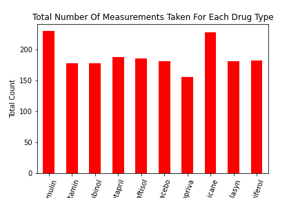

# Matplotlib Homework - The Power of Plots

## **Please use file pymaceuticals_starter_2.ipynb.** 

### Data Analysis

Information from observations in initial dataframe creation
1. The raw data had 1893 datapoints that included data from 249 mice.
2. The timepoints for each mouse ranged from 0-45, incrementally by 5s.
3. Tumor size was initially 45 mm3 for the mice.
4. 10 differnt drug regimens were used -Ramicane	Capomulin	Infubinol	Placebo	Ceftamin	Stelasyn	Zoniferol	Ketapril	Propriva	Naftisol.
5. The sex of the mice was a fairly even split- 49.3 % female and 50.7% males.
6. Tumor size increases with mouse size, having an -r value of nearly 1.  This means that it is fairly accurate that most mouse weigth to tumor size will follow this pattern.  

* 5 duplicate timepoints were found for mouse ID g989 Timepoints-0,5,10,15,20.  These 5 datapoints were removed to perform analysis accuratly.

The data was then plotted by drug type to see the mice distribution per drug type.  
The distribution was fairly even, ~50 more in Capomulin and Ramicane.  See table below.

**Statistical Analysis on the 10 Drug Regimens compared to Tumor Size**
The drugs that had the lowest mean tumor size were - Capomulin, Ramicane, Propriva and Ceftamin respectively.
The drug with the lowest overall tumor size data were - Ramicane, Capomulin and Infubinol respectively.
The standard deviation and standard error of mean were tightest with Ramicane and Capomulin.  This helps to identify that the datapoints collected are more precise and perhaps repeatable.

Some of the drug regimens had an increase in mean tumor size in comparison to the placebo group, which would mean the the drug was not as effective or even ineffective, as some of the other drugs.  

Observations made from final data point per mouse.

Information for the interquartile range is tightest (7.78 and 9.1) and mean lowest (38.1 and 36.6) for Capomulin and Ramicane, this would imply the these drug regimens are more affective at reducing tumor size in mice during the studies time span.

Line graphs were visualized for mulitple individual mice in the Capomulin group.  The mice had varying results some initially decreasing then increasing in size, others initially increasing in size then drastically decreasing in size.  The overall pattern wasn't consistent for each mouse but the final size did decrease in all of the mice over the study period with drug Capomulin.

I believe there are some short comings in the data that was provided and the graphs and tables that are requested for the excersize.
-The data didn't state how long the study lasted (timepoints were not properly defined).  Could some mice have been removed from the study or died.  Should we have only used data from mice that recieved the same amount of drug and time within the study?  This could be explored with more tables.
-We also didn't look at how the sex was distributed by drug regimen.  One sex may be more receptive to a specific drug than another.

## With the data that was analysed I would say that drugs Capomulin is the best out of the 9 and Ramicane is second.  As the final tumor size decreased for all of the mice in the study and the standard deviation and standard error of mean was low also.
